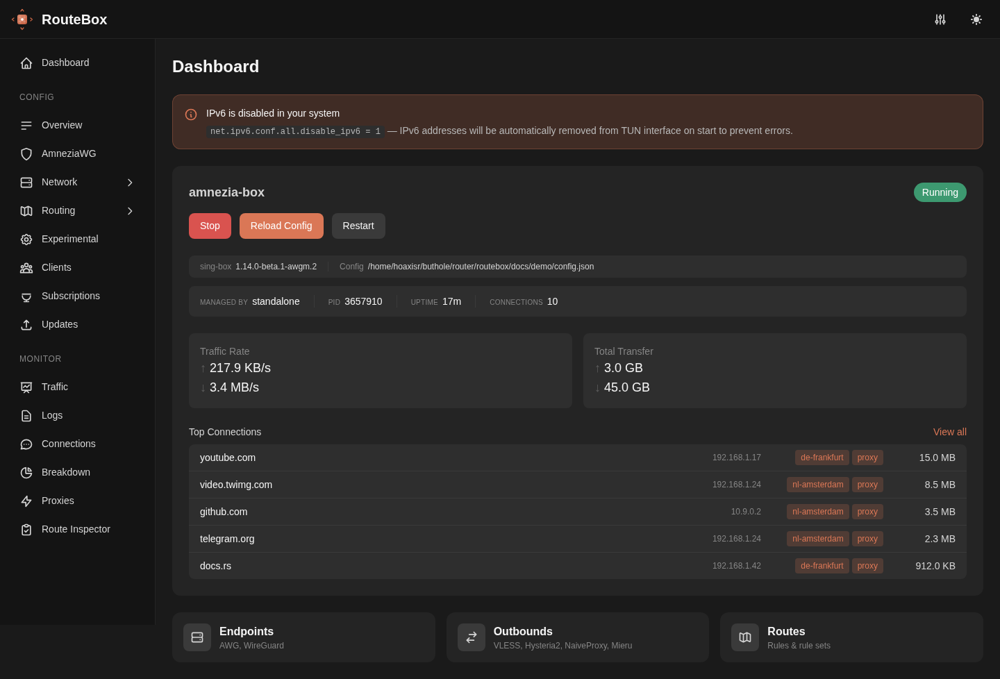
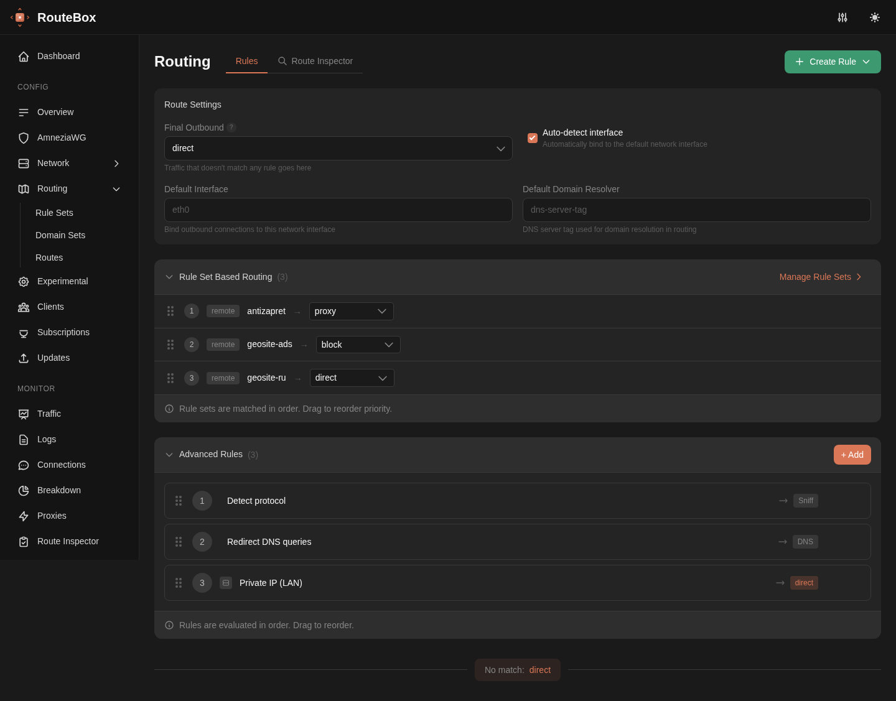
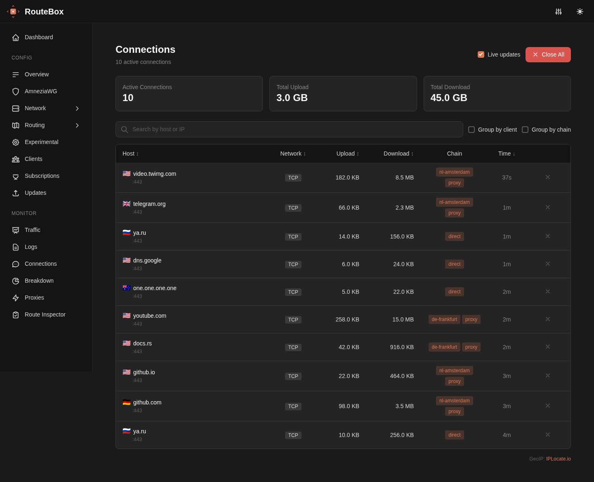
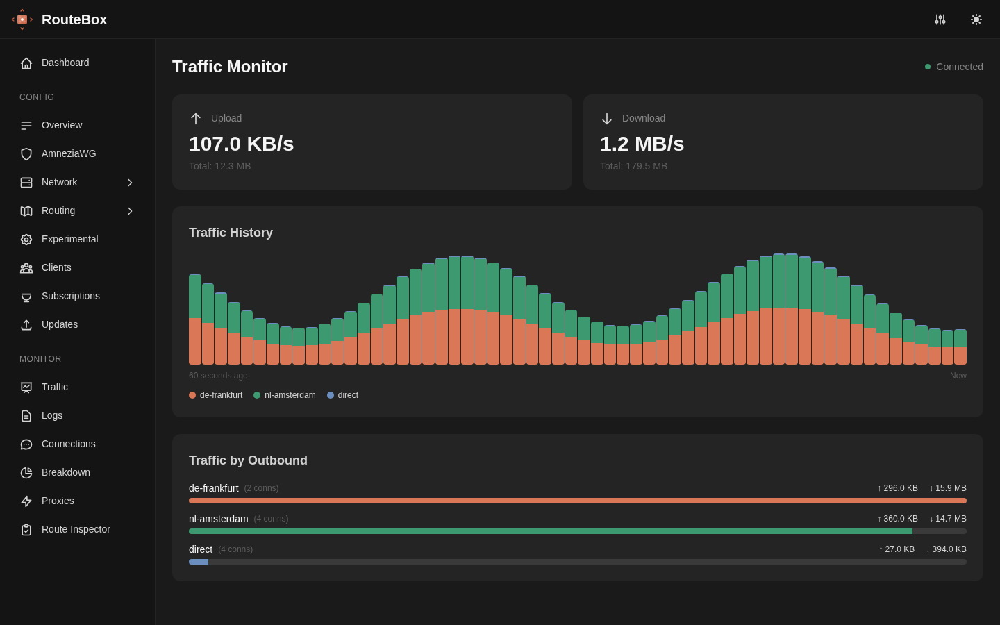
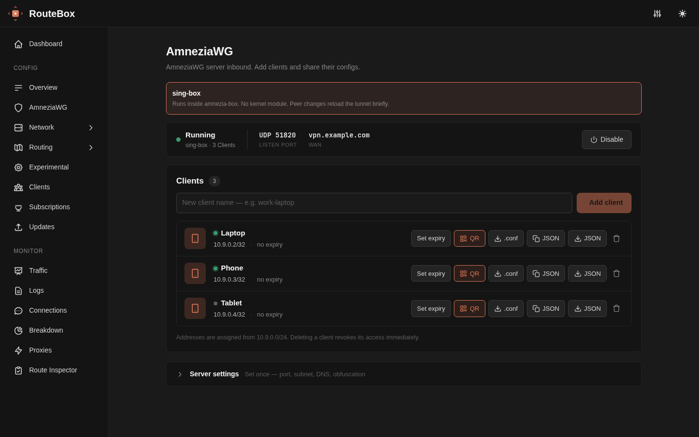
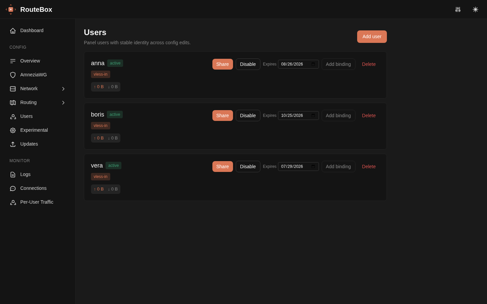

# RouteBox

[](https://github.com/hoaxisr/routebox/releases/latest)
[](#лицензия)


Веб-панель для [amnezia-box](https://github.com/hoaxisr/amnezia-box) (форк sing-box). Один бинарник со встроенным интерфейсом, два сценария: VPN-роутер для домашней сети и панель управления прокси-сервером на VPS.



## Два режима

| | Роутер дома | Панель на VPS |
|---|---|---|
| Что делает | Направляет трафик домашней сети через VPN: целиком или только выбранные сайты | Управляет VPN-сервером: протоколы, пользователи, подписки |
| Установка | [`install.sh`](https://github.com/hoaxisr/routebox/blob/main/install.sh) | [`vps-install.sh`](https://github.com/hoaxisr/routebox/blob/main/vps-install.sh) |
| Доступ | `http://IP-роутера:8080` | `https://домен:8443`, TLS-сертификат Let's Encrypt выпускается автоматически |
| Авторизация | Опциональна | Обязательна, пароль администратора генерируется при установке |
| Что подключается | AmneziaWG / WireGuard, VLESS, Hysteria2, NaiveProxy, Mieru — по ссылке или файлу | Клиенты пользователей — по ссылке-подписке, QR-коду или файлу конфигурации |

Режим задаётся ключом `mode` в настройках; интерфейс показывает только разделы своего режима.

## Возможности

**Маршрутизация**
- Готовые списки: Antizapret, geosite/geoip rule-sets; свои списки доменов
- Приоритет правил перетаскиванием, продвинутые правила по домену, IP, порту, процессу
- Настройка DNS-серверов и DNS-правил
- Route Inspector: проверка, каким правилом и куда уйдёт запрос

**Подключения (клиентская сторона)**
- Эндпоинты AmneziaWG (включая обфускацию AWG 1.0/2.0/3.0) и WireGuard — импорт из `.conf`
- Аутбаунды VLESS, Hysteria2, NaiveProxy, Mieru — импорт по ссылкам `vless://`, `hy2://`, `naive+https://`, `mierus://`
- Группы selector и urltest, подписки с автообновлением

**Сервер (режим VPS)**
- Инбаунды VLESS (в том числе Reality), Hysteria2, NaiveProxy, Mieru; транспорты raw / ws / grpc / httpupgrade / xhttp
- Сервер AmneziaWG (включая версию AWG 3.0) без модуля ядра, с обфускацией и профилями маскировки; выдача клиентам QR-кода, `.conf` и sing-box JSON
- Пользователи: ссылки-подписки, сроки действия, включение и отключение, учёт трафика

**Мониторинг**
- Трафик в реальном времени с историей, разбивка по исходящим узлам
- Активные соединения с флагами стран (GeoIP), цепочкой узлов и объёмами
- Логи amnezia-box и журнал systemd

**Обслуживание**
- Проверка и установка обновлений RouteBox и amnezia-box из панели
- Валидация конфигурации перед применением, черновики и откат изменений

## Быстрый старт: роутер дома

Требования: Linux (amd64 или arm64) с systemd, права root.

```bash
curl -fsSL https://raw.githubusercontent.com/hoaxisr/routebox/main/install.sh | sudo bash
```

Скрипт скачивает последние релизы RouteBox и amnezia-box, кладёт настройки в `/etc/routebox/`, скачивает базу GeoIP, включает IP-forwarding и создаёт systemd-сервисы `routebox` и `amnezia-box`.

Дальше:

```bash
sudo systemctl start routebox
```

1. Откройте `http://IP-устройства:8080`.
2. Добавьте подключение: вставьте ссылку или файл конфигурации вашего VPN в разделе Endpoints или Outbounds.
3. В разделе Routes выберите, что маршрутизировать через VPN — весь трафик или списки сайтов.
4. На устройствах домашней сети укажите IP роутера как шлюз (или раздайте его по DHCP).







## Быстрый старт: панель на VPS

Требования:

- VPS на Linux (amd64 или arm64) с systemd, права root.
- **Домен с A/AAAA-записью на IP сервера** — обязателен: по нему встроенный ACME выпускает TLS-сертификат панели. По «голому» IP панель не откроется (TLS-сертификату нужен SNI домена).
- Порты `8443/tcp` (панель) и `80/tcp` (HTTP-01 проверка Let's Encrypt; должен оставаться открытым — продления идут по нему же). Установщик откроет их в ufw, если он активен. Порты 443 и 22 скрипт не трогает.

Первый запуск лучше делать с флагом `--staging` — он использует тестовый каталог Let's Encrypt и не расходует лимит выпуска сертификатов:

```bash
curl -fsSL https://raw.githubusercontent.com/hoaxisr/routebox/main/vps-install.sh \
  | sudo bash -s -- --domain panel.example.com --email you@example.com --staging
```

Когда всё работает, повторный запуск без `--staging` переключает панель на боевой сертификат:

```bash
curl -fsSL https://raw.githubusercontent.com/hoaxisr/routebox/main/vps-install.sh \
  | sudo bash -s -- --domain panel.example.com --email you@example.com
```

Флаги:

- `--domain` — домен панели (без него установщик спросит интерактивно);
- `--email` — контакт для Let's Encrypt;
- `--port <n>` — порт панели (по умолчанию `8443`);
- `--staging` — тестовый CA Let's Encrypt.

Скрипт проверяет DNS, ставит оба бинарника с проверкой sha256, настраивает systemd и firewall. Сертификат RouteBox выпускает и продлевает сам — nginx и certbot не нужны.

Панель доступна на `https://panel.example.com:8443` — открывайте по домену, не по IP. Логин `admin`, пароль генерируется при первом старте и сохраняется в `/etc/routebox/routebox-initial-password` (также виден в `journalctl -u routebox`). Смените его после входа в разделе App Settings → Security.





## Docker (панель на VPS)

Образ собран на [base image LinuxServer.io](https://docs.linuxserver.io/general/containers-101/) и умеет только режим панели на VPS. Режим роутера в Docker не поддерживается: ему нужен TUN и роль шлюза локальной сети — для него есть `install.sh` на голом железе.

```bash
curl -fsSLO https://raw.githubusercontent.com/hoaxisr/routebox/main/docker-compose.yml
# отредактируйте PUBLIC_HOST и ACME_EMAIL в docker-compose.yml
docker compose up -d
```

- `/config` — единственный volume: `routebox.toml`, конфиг amnezia-box, сам бинарник amnezia-box (`/config/bin`), GeoIP-база, `traffic.db`, ACME-кэш, данные сервера AmneziaWG. Внутри контейнера `/etc/routebox` и `/etc/amnezia/amneziawg` — симлинки сюда же, так что всё состояние панели лежит в одном месте.
- Если `routebox.toml` в `/config` ещё нет, контейнер пишет минимальный конфиг из переменных окружения — то же самое, что спрашивает `vps-install.sh`. Пароль администратора панель генерирует сама при первом старте и кладёт в `/config/routebox-initial-password`; он же виден в `docker compose logs routebox`.
- **Переменные окружения читаются только в этот момент.** Дальше правит файл, его же меняет панель — поэтому новый `PUBLIC_HOST` в `docker-compose.yml` после первого запуска уже ничего не изменит, о чём контейнер предупредит в логе. Домен меняйте в `/config/routebox.toml`. Контейнер понимает `PUBLIC_HOST`, `ACME_EMAIL`, `ACME_STAGING`, `ACME_ENABLED`, `ACME_HTTP_ADDR` и `LISTEN`. Пример `PUBLIC_HOST=panel.example.com` считается незаполненным: просить у Let's Encrypt сертификат на чужой домен бессмысленно, а неудачные проверки идут в счёт лимитов.
- amnezia-box контейнер копирует из образа в `/config/bin/amnezia-box` при первом запуске, дальше бинарник живёт на volume. Поэтому обновление из панели работает (файлом владеет пользователь `PUID`) и переживает пересоздание контейнера. Уже установленный бинарник образ не трогает; если он старше, чем в образе, контейнер скажет об этом в логе. Нужна версия из образа — удалите файл и перезапустите контейнер.
- systemd в контейнере нет, поэтому amnezia-box запускает сам RouteBox — при каждом старте, если конфиг и бинарник на месте. Start/Stop/Restart в панели работают как обычно.
- Наружу отданы `8443` (панель) и `80` (ACME HTTP-01; его нужно держать открытым и ради продлений). Инбаунды amnezia-box вы настраиваете в панели и публикуете сами через `ports:`. Панель и инбаунды работают не под root, но Docker выставляет в контейнерах `net.ipv4.ip_unprivileged_port_start=0`, так что порт <1024 занимается и без `NET_BIND_SERVICE`. Если ваш runtime так не умеет — добавьте `cap_add: [NET_BIND_SERVICE]` или дайте инбаунду порт ≥1024 внутри контейнера и пробросьте его на нужный (`"443:8444"`), а для ACME задайте `ACME_HTTP_ADDR`.
- `PUID`/`PGID` — как в любом образе LinuxServer.io: задают владельца файлов в `/config`. Состояние контейнера показывает `HEALTHCHECK`: он опрашивает `/api/health`.
- Сервер AmneziaWG по умолчанию работает на бэкенде `singbox`: ему не нужны ни модуль ядра, ни права, ни лишние настройки — с ним контейнер запускается как есть.
- Бэкенд `kernel` в образе тоже работает, но его нужно включить осознанно. Нужны три вещи: модуль `amneziawg`, загруженный **на хосте** (`modprobe amneziawg`; DKMS-пакет `amneziawg-dkms` плюс заголовки ядра), `cap_add: [NET_ADMIN]` у контейнера и проброшенный UDP-порт сервера — он не HTTP и через обратный прокси не пойдёт. amneziawg-tools уже в образе. Панель проверяет и инструменты, и capability, и отказывает с указанием, чего именно не хватает, а не падает потом на включении.

```yaml
cap_add:
  - NET_ADMIN
sysctls:
  - net.ipv4.ip_forward=1
ports:
  - "51820:51820/udp"   # порт сервера AmneziaWG из настроек панели
```

  Без `cap_add` панель работает ровно как раньше — без привилегий, на бэкенде `singbox`. Capability выдаётся через ambient set, поэтому её видят и `awg-quick`, и запускаемые им `ip`/`iptables`, а сам процесс панели остаётся под пользователем `PUID`, не под root. Ambient-права наследуют все дочерние процессы панели, включая amnezia-box, — поэтому включать бэкенд `kernel` стоит только если он вам действительно нужен.
- Версию amnezia-box можно зафиксировать при сборке: `docker build --build-arg AMNEZIA_BOX_VERSION=1.14.0-beta.4-awgm.5 .`. По умолчанию берётся последний релиз, а какой именно — записано в `/defaults/amnezia-box.version`.

### За обратным прокси

Если TLS уже держит nginx, Caddy или Traefik, встроенный ACME не нужен: RouteBox отдаёт панель по обычному HTTP, сертификат остаётся заботой прокси. Порт `80` наружу не публикуется, `ACME_EMAIL` можно не задавать.

```yaml
environment:
  - PUID=1000
  - PGID=1000
  # Публичный адрес панели: он попадает в ссылки-подписки, поэтому это адрес
  # прокси, а не контейнера.
  - PUBLIC_HOST=panel.example.com
  - PUBLIC_PORT=443
  - ACME_ENABLED=false
  # Чьему X-Forwarded-For верить: адрес прокси или подсеть общей docker-сети.
  # Перечислите обе версии протокола — см. ниже.
  - TRUSTED_PROXIES=172.18.0.0/16,fd00:dead:beef::/64
ports: []
expose:
  - "8443"
```

**В списке должны быть обе версии протокола.** Docker отвечает на DNS-запрос сначала AAAA, поэтому в сети с включённым IPv6 прокси приходит к контейнеру по ULA-адресу, даже если вы указали только IPv4 — а незаписанный адрес просто не считается доверенным, молча. Подсети общей сети покажет `docker network inspect <сеть> -f '{{range .IPAM.Config}}{{.Subnet}} {{end}}'`. Если RouteBox видит `X-Forwarded-For` с адреса не из списка, он пишет об этом в лог один раз на адрес.

`TRUSTED_PROXIES` стоит задать сразу. На адресе клиента завязаны блокировка перебора пароля и лимит запросов к публичному `/sub/{token}`, а из-за прокси все клиенты приходят с одного адреса и считаются за одного: лимит подписок срабатывает через несколько запросов и накрывает всех разом. Заголовку RouteBox верит только от перечисленных адресов, с остальных смотрит на реальный адрес соединения — подделать не выйдет. Из цепочки берётся самый правый адрес, которого нет в списке: это то, что видел ваш собственный прокси.

Прокси должен пробрасывать WebSocket-соединения — по ним на дашборд идут трафик, логи и список соединений — и передавать `X-Forwarded-Proto`, иначе cookie сессии останется без флага `Secure`.

nginx:

```nginx
server {
    listen 443 ssl http2;
    server_name panel.example.com;

    ssl_certificate     /etc/letsencrypt/live/panel.example.com/fullchain.pem;
    ssl_certificate_key /etc/letsencrypt/live/panel.example.com/privkey.pem;

    location / {
        proxy_pass http://routebox:8443;
        proxy_http_version 1.1;
        proxy_set_header Upgrade $http_upgrade;
        proxy_set_header Connection $connection_upgrade;
        proxy_set_header Host $host;
        proxy_set_header X-Forwarded-For $proxy_add_x_forwarded_for;
        proxy_set_header X-Forwarded-Proto $scheme;
        # Дашборд держит WebSocket открытым, с дефолтным таймаутом он рвётся.
        proxy_read_timeout 3600s;
        proxy_buffering off;
    }
}

# в http-блоке:
# map $http_upgrade $connection_upgrade { default upgrade; "" close; }
```

Caddy — `X-Forwarded-*` и WebSocket из коробки:

```caddy
panel.example.com {
    reverse_proxy routebox:8443
}
```

Инбаунды amnezia-box через прокси не пойдут: это не HTTP. Их порты контейнер публикует сам через `ports:`. Через прокси ходят панель и подписки, VPN-трафик — мимо.

Обновление образа:

```bash
docker compose pull && docker compose up -d
```

Раздел Updates работает и здесь: amnezia-box ставится прямо из панели, и обновление никуда не денется после `docker compose up -d` — бинарник лежит на volume. Для самого RouteBox панель вместо кнопки показывает команду выше: свой бинарник он берёт из образа.

## Обновление

В обоих режимах: раздел Updates в панели проверяет и ставит новые версии RouteBox и amnezia-box. Список изменений — в [CHANGELOG.md](CHANGELOG.md).

Из консоли:

```bash
# Роутер: повторный запуск установщика обновляет бинарники, настройки не трогает
curl -fsSL https://raw.githubusercontent.com/hoaxisr/routebox/main/install.sh | sudo bash

# VPS: конфигурация и сертификат сохраняются
sudo bash vps-install.sh --update
```

## Удаление

```bash
# Роутер (каталоги настроек остаются)
curl -fsSL https://raw.githubusercontent.com/hoaxisr/routebox/main/install.sh | sudo bash -s -- --uninstall

# VPS; --purge дополнительно удаляет /etc/routebox и /etc/amnezia-box
sudo bash vps-install.sh --uninstall
```

<details>
<summary><b>Конфигурация: routebox.toml и GeoIP</b></summary>

Настройки приложения хранятся в `/etc/routebox/routebox.toml` ([пример с комментариями](https://github.com/hoaxisr/routebox/blob/main/routebox.toml)). Большинство параметров также доступно в панели в разделе App Settings.

| Секция | Описание |
|--------|----------|
| `[geoip]` | Путь к MMDB-базе, включение GeoIP |
| `[ui]` | Тема, язык (en/ru), единицы скорости, формат времени |
| `[monitoring]` | GeoIP-обогащение соединений, история закрытых соединений, интервалы опроса |
| `[security]` | Авторизация панели, CORS, таймаут сессии |
| `[network]` | Адрес и порт панели, таймауты, сжатие, TLS (свой сертификат или встроенный ACME/Let's Encrypt) |
| `[server]` | Режим (`router`/`vps`), публичный хост и порт для ссылок-подписок |
| `[singbox]` | Путь к конфигу amnezia-box, адрес Clash API, имя systemd-сервиса, адрес v2ray-статистики. Путь к бинарнику не настраивается: он ищется в `/usr/local/bin`, `/usr/bin`, `/opt/amnezia-box` и `PATH` |
| `[updates]` | Ежедневная автопроверка обновлений |
| `[awg]` | Сервер AmneziaWG: интерфейс, подсеть, порт, DNS, бэкенд, обфускация |
| `[advanced]` | Интервалы WebSocket-пинга |

### GeoIP

Установщик скачивает базу [IPLocate ip-to-country](https://github.com/iplocate/ip-address-databases) в `/etc/routebox/geoip.mmdb` — флаги стран в мониторе соединений работают сразу. Ручное обновление базы:

```bash
sudo curl -fsSL -o /etc/routebox/geoip.mmdb \
  https://github.com/iplocate/ip-address-databases/raw/main/ip-to-country/ip-to-country.mmdb
sudo systemctl restart routebox
```

Обновление можно повесить на cron (с перезапуском сервиса). Подходит любая MMDB-база (IPInfo, MaxMind GeoLite2) — укажите путь в `path`.

</details>

<details>
<summary><b>Параметры запуска и приоритет настроек</b></summary>

```
routebox [флаги]
routebox version      # версия

--settings PATH   Путь к routebox.toml (по умолчанию: авто-поиск)
--config PATH     Путь к конфигу amnezia-box (переопределяет settings)
--listen ADDR     Адрес веб-интерфейса (переопределяет settings)
--geoip PATH      Путь к GeoIP MMDB (переопределяет settings)
--clash ADDR      Адрес Clash API (по умолчанию берётся из конфига amnezia-box)
--mode MODE       Режим панели: router (по умолчанию) или vps
```

Приоритет: флаги командной строки → `routebox.toml` → авто-определение → значения по умолчанию.

RouteBox требует запуска от root — он создаёт TUN-интерфейсы и управляет системными сервисами.

</details>

<details>
<summary><b>REST API</b></summary>

Все эндпоинты, кроме `/api/health` и `/api/auth/*`, требуют сессию, если авторизация включена. Основные:

| Endpoint | Описание |
|----------|----------|
| `GET /api/status` | Статус процесса amnezia-box |
| `GET` / `PUT /api/config` | Полный конфиг sing-box |
| `POST /api/config/apply` | Применить изменения (reload/restart) |
| `POST /api/config/fix-unit` | Перенацелить systemd-юнит на конфиг, которым управляет RouteBox (drop-in) |
| `DELETE /api/config/unit-dropin` | Снять этот drop-in — обратная операция к `fix-unit` |
| `POST /api/config/adopt-unit-path` | Перейти на путь конфига из `ExecStart` юнита (второе лечение расхождения) |
| CRUD `/api/endpoints`, `/api/outbounds`, `/api/inbounds` | Подключения |
| CRUD `/api/route/rules`, `/api/route/rule-sets` | Маршрутизация |
| CRUD `/api/dns/servers`, `/api/dns/rules` | DNS |
| CRUD `/api/users` | Пользователи панели (режим vps) |
| `/api/awg/*` | Сервер AmneziaWG: статус, пиры, конфиги |
| `GET` / `PUT /api/settings` | Настройки RouteBox |
| `GET /api/clash/*` | Прокси к Clash API |
| WS `/api/clash/traffic`, `/api/clash/connections`, `/api/clash/logs` | Данные в реальном времени |
| `GET /sub/{token}` | Публичная ссылка-подписка пользователя |

</details>

<details>
<summary><b>Ручная установка и systemd</b></summary>

Бинарники публикуются в [GitHub Releases](https://github.com/hoaxisr/routebox/releases):

```bash
# amd64; для arm64 замените суффикс
curl -fsSL -o routebox \
  https://github.com/hoaxisr/routebox/releases/latest/download/routebox-linux-amd64
curl -fsSL -O \
  https://github.com/hoaxisr/routebox/releases/latest/download/routebox-linux-amd64.sha256
sha256sum -c routebox-linux-amd64.sha256 --ignore-missing || echo "checksum mismatch"
chmod +x routebox

sudo cp routebox /usr/local/bin/
sudo mkdir -p /etc/routebox /etc/amnezia-box
```

Также понадобится бинарник amnezia-box из [релизов форка](https://github.com/hoaxisr/amnezia-box/releases) в `/usr/local/bin/amnezia-box`.

Systemd-сервис:

```bash
sudo tee /etc/systemd/system/routebox.service << 'EOF'
[Unit]
Description=RouteBox - VPN Router Web UI
After=network.target

[Service]
Type=simple
ExecStart=/usr/local/bin/routebox --settings /etc/routebox/routebox.toml
Restart=always
RestartSec=2

[Install]
WantedBy=multi-user.target
EOF

sudo systemctl daemon-reload
sudo systemctl enable --now routebox
```

Для работы в режиме роутера включите IP-forwarding:

```bash
sudo sysctl -w net.ipv4.ip_forward=1
echo "net.ipv4.ip_forward=1" | sudo tee -a /etc/sysctl.conf
```

</details>

<details>
<summary><b>Сборка из исходников</b></summary>

Понадобятся Go 1.21+ и Node.js с npm.

```bash
git clone https://github.com/hoaxisr/routebox
cd routebox

# Фронтенд (SvelteKit -> статика, встраивается в бинарник)
cd frontend && npm install && npm run build && cd ..
rm -rf backend/internal/embedded/dist/*
cp -r frontend/build/* backend/internal/embedded/dist/

# Бэкенд
go build -ldflags "-X main.Version=$(sed -n 's/.*"version": "\(.*\)".*/\1/p' frontend/package.json)" \
  -o routebox ./backend/cmd/routebox

sudo ./routebox
```

</details>

## Лицензия

MIT
